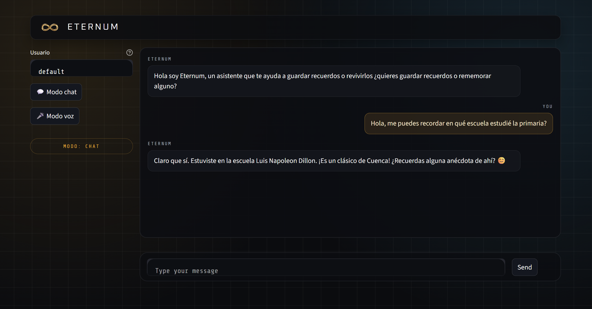
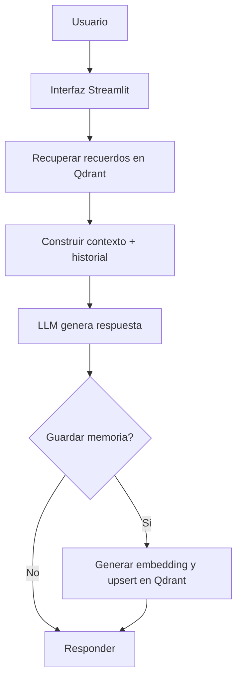

# ETERNUM

## Que hace la aplicacion
ETERNUM es una app Streamlit de chat con memoria persistente. Permite conversar con un
agente que recupera recuerdos relevantes desde Qdrant y decide que nuevos recuerdos
guardar para personalizar futuras respuestas.

## Flujo del agente

## Funcionamiento
- Recibe mensaje del usuario y el historial de chat.
- Busca recuerdos similares en Qdrant usando embeddings.
- Construye el prompt con el sistema, recuerdos recuperados y el historial reducido.
- Genera la respuesta con el modelo (Ollama u OpenAI segun configuracion).
- Un segundo paso decide si el mensaje debe guardarse como memoria y evita duplicados.
- Si aplica, almacena el recuerdo con metadatos (tenant_id, tipo, importancia, fecha).

## Base de datos: Qdrant
La memoria vectorial se guarda en Qdrant. Se usa una coleccion configurable y se filtra
por usuario (`tenant_id`) para mantener la memoria aislada.

Campos principales en el payload:
- `tenant_id`
- `memory_id`
- `memory_type`
- `text`
- `created_at`
- `importance`
- `source`

## Componentes clave
- `app.py`: UI Streamlit y manejo del chat.
- `backend/memory_agent.py`: grafo de LangGraph con recuperacion, generacion y guardado.
- `backend/qdrant_store.py`: busqueda y upsert en Qdrant.
- `backend/config.py`: variables de entorno y parametros.
